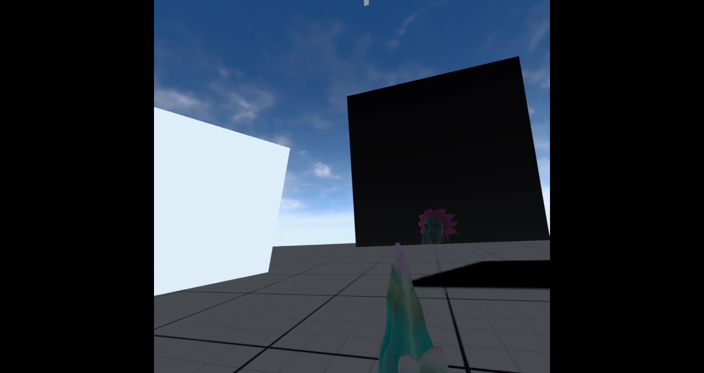
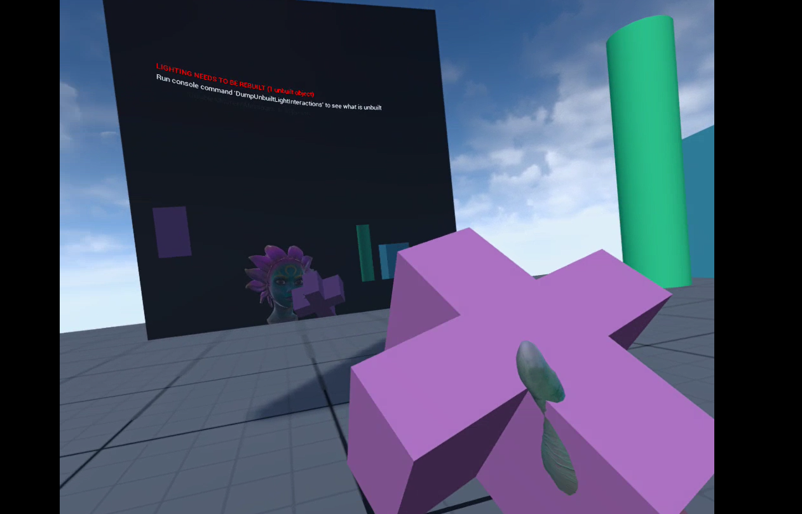

#  自闭症的 UE5 项目

流程方面分为三个部分：

## 场景一：精细动作摹仿

### 功能

1. 肢体动作识别，包括（1）双手合掌；（2）伸大拇指；（3）碰两根食指；（4）指鼻子、眼睛、嘴和眉毛。（已完成）
2. 交互引导组件，每完成一个动作，则通过模型、语音和图片引导用户进行下一个动作。（未全部完成，缺少一个模型作为代理角色增加互动性）
3. 交互信息记录，包括完成动作的时间，尝试次数。（未全部完成，仅有时间）

## 场景二：几何体匹配

### 功能

1. 相同模型匹配，用户抓起一个模型，立刻出现提示用户完成匹配。（已完成）
2. 交互引导组件，每完成一个动作，则通过模型、语音和图片引导用户进行下一个动作。（未完成）
3. 交互信息记录，包括完成动作的时间，尝试次数。（已完成）

## 场景三：看图问答

### 功能

1. 图片展示并提问，想用户展示图片，并以此提问。用户需要回答提出的问题。过程中涉及语音捕获、语音识别、关键词判别、网络传输等子功能。（未完成）
2. 交互引导组件，每完成一个动作，则通过模型、语音和图片引导用户进行下一个动作。（未完成）
3. 交互信息记录，包括完成问答的时间，尝试次数。（未完成）

## 其他功能
1. 客观指标和评估结果展示 (未完成)

## 缺少的素材

1. 场景素材，需要背景素材增加沉浸感。
2. 交互代理模型（包括动作）。
3. 交互UI的美化。